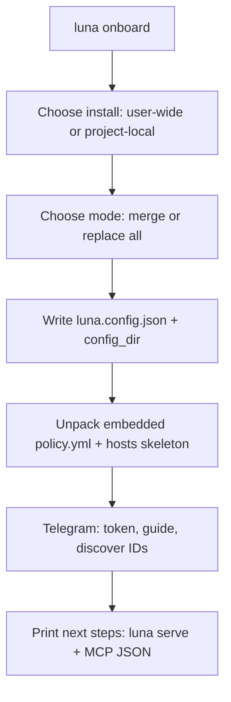

# Luna `onboard` — interactive first-run setup

**Date:** 2026-05-23  
**Status:** Implemented — [2026-05-23-luna-onboard.md](../plans/2026-05-23-luna-onboard.md)

## Summary

Add `luna onboard`, an **interactive-only** subcommand that creates Luna configuration, unpacks **embedded compressed** example policy files into the chosen config directory, and walks the user through **Telegram** setup (including discovering `approver_user_id` after they message the bot).

No non-interactive flags in v1 (beyond `--help`). The binary must not depend on the repository `examples/` tree at runtime.

## Goals

- Reduce manual copy steps from [examples/luna.d/README.md](../../../examples/luna.d/README.md) and README Quick Start.
- Produce a layout that `luna serve` can use immediately: `policy.yml`, optional `hosts.yml`, `luna.config.json`, Telegram token file.
- Keep the CLI layer thin (`cmd/onboard.go` → `internal/onboard`).

## Non-goals (v1)

- `--yes`, `--target`, `--non-interactive`, or CI automation flags.
- Multiple embedded policy presets (minimal vs strict, etc.).
- Writing `env.example` or copying full example host inventory.
- Changing `serve` approval architecture (still in-memory Telegram-only).

## Decisions (brainstorming)

| Topic | Decision |
|--------|----------|
| Install location | Ask each run; **default user-wide** |
| Existing files | Single prompt: **merge** (skip existing) vs **replace all** |
| Telegram | Full interactive setup; **guide + `getUpdates` discovery** after bot token |
| Embedded assets | Default `policy.yml` (current baseline) + **skeleton** `hosts.yml` only |
| CLI flags | Interactive only |

## Recommended approach

**Thin CLI + `internal/onboard` + `go:embed` gzip tarball** (stdio prompts, no new UI dependencies). Reuse Telegram HTTP patterns from `internal/approval` where practical.

Alternatives considered: Charm `huh` forms (extra dependency); shipping examples beside the binary (fragile across install paths).

## Command

```text
luna onboard
```

**Short:** Interactive first-run setup for Luna config, policy, and Telegram.

**Requires:** interactive TTY (stdin is a terminal). If not a TTY, exit with a clear error.

## User flow



### Step details

1. **Welcome** — Explain created files; pointer to [docs/oob-approval.md](../../oob-approval.md).
2. **Location** (default: user-wide):
   - **User-wide:** `~/.config/luna/luna.config.json`, `config_dir` → `~/.config/luna/luna.d/`
   - **Project-local:** `./luna.config.json`, `config_dir` → `./luna.d/`
3. **Conflict mode** — One choice for the whole run:
   - **Merge:** skip any path that already exists; log skipped paths.
   - **Replace all:** overwrite existing files in the target layout.
4. **Write `luna.config.json`** — Include `config_dir`, `approval.ttl` default `10m`, Telegram fields filled in step 6.
5. **Materialize embedded bundle** — Create directories (`0755`), files (`0644`).
6. **Telegram** (required for usable `serve`):
   - Prompt for bot token; write to **`bot_token_file`** under the config root (mode `0600`), not inline in JSON.
   - **Guide:** Open the bot in Telegram, send `/start`, return to the terminal and continue.
   - **Discover IDs:** Short-lived `getUpdates` poll (message updates only); set `approver_user_id` from `message.from.id`, `chat_id` from `message.chat.id` (default private chat).
   - If poll fails: one retry, then manual numeric id entry with instructions.
7. **Finish** — Print written paths, remind user to edit skeleton `hosts.yml`, show MCP client command `["/absolute/path/to/luna", "serve"]`.

## File layout

| Artifact | User-wide | Project-local |
|----------|-----------|---------------|
| JSON config | `~/.config/luna/luna.config.json` | `./luna.config.json` |
| Policy directory | `~/.config/luna/luna.d/` | `./luna.d/` |
| `policy.yml` | `<config_dir>/policy.yml` | same |
| `hosts.yml` | `<config_dir>/hosts.yml` | same |
| Bot token file | `<config_root>/telegram-bot-token` | `<config_root>/telegram-bot-token` where `config_root` is parent of `luna.d` for project layout (`./`) or `~/.config/luna` for user-wide |

**JSON shape** (aligned with [examples/luna.config.json](../../../examples/luna.config.json)):

```json
{
  "config_dir": "<relative or absolute per choice>",
  "approval": { "ttl": "10m" },
  "telegram": {
    "bot_token_file": "<path>",
    "approver_user_id": "<discovered>",
    "chat_id": "<discovered>"
  }
}
```

For user-wide installs, `config_dir` in JSON should resolve consistently with [internal/config/settings.go](../../../internal/config/settings.go) discovery (`luna.d` under `~/.config/luna`).

## Embedded bundle

### Contents

| File | Source at build time |
|------|----------------------|
| `policy.yml` | Current [examples/luna.d/policy.yml](../../../examples/luna.d/policy.yml) baseline |
| `hosts.yml` | **Skeleton only** (not example production hosts) |

### Skeleton `hosts.yml`

```yaml
version: 1
hosts:
  - alias: example-host
    host: user@hostname
    tags: []
    description: ""
```

### Build and runtime

- Package: `internal/onboard/`
- `//go:embed bundle.tar.gz` in `assets.go` (or equivalent).
- Build step (`go generate` or Makefile target): gzip tarball of the two files; commit generated tarball **or** generate in `go generate` before compile (team choice in implementation plan — prefer `go generate` + checked-in bundle for reproducible releases).
- Runtime: `gzip` + `archive/tar` extract with **path traversal protection** (reject `..`, absolute paths, unexpected names).

### Not embedded

- `env.example` (contains stale fields; not written by onboard).
- `examples/luna.d/README.md` — replaced by onboard stdout + existing docs.

## Telegram ID discovery

### UX

After token is saved:

1. Print numbered steps: open Telegram → find bot → send `/start` → press Enter here.
2. Call Telegram Bot API `getUpdates` with short timeout, limited attempts (~2 minutes total).
3. Use latest **message** update (not `callback_query`): `from.id` → `approver_user_id`, `chat.id` → `chat_id`.
4. If multiple users messaged the bot, use the **most recent** message and print a warning.

### Implementation

- Prefer `DiscoverTelegramApprover(ctx, token, httpClient)` in `internal/onboard` or shared `internal/approval/telegram_discover.go` with httptest coverage.
- Reuse API base URL and request shapes from [internal/approval/provider_telegram.go](../../../internal/approval/provider_telegram.go) / [telegram_poll.go](../../../internal/approval/telegram_poll.go).

### Security

- Never log the bot token.
- Token file mode `0600`.
- Do not echo token to stdout after entry (optional: mask input; minimum is “token saved to …”).

## Components

| Unit | Responsibility |
|------|----------------|
| `cmd/onboard.go` | Cobra command, TTY check, delegate to runner |
| `internal/onboard/runner.go` | Orchestrates prompts and write order |
| `internal/onboard/prompt.go` | Stdio multiple-choice and text prompts |
| `internal/onboard/layout.go` | Resolve paths for user-wide vs project-local |
| `internal/onboard/install.go` | Merge/replace writes, mkdir, JSON marshal |
| `internal/onboard/bundle.go` | Embed load + safe tar extract |
| `internal/onboard/telegram.go` | Token file + discovery + manual fallback |

## Error handling

| Condition | Behavior |
|-----------|----------|
| Non-TTY stdin | Exit 1, message: interactive terminal required |
| User interrupt (Ctrl+C) | Exit 130; stderr notes partial writes possible in merge mode |
| Invalid / empty token | Re-prompt once, then exit 1 |
| Telegram API errors | Retry discovery once; offer manual id entry |
| Merge + all targets exist | Success with “nothing to do” summary |
| Replace + permission denied | Exit 1 with path in error |

## Testing

| Area | Approach |
|------|----------|
| Tar extract | Table tests: safe names, reject `../evil` |
| Install logic | Temp dir: merge skips, replace overwrites |
| JSON output | Golden or field assertions for `config_dir` / telegram paths |
| Telegram discovery | `httptest` mock `getUpdates` JSON |
| E2E Telegram | Out of scope for CI |

## Documentation updates (implementation)

- README Quick Start: mention `luna onboard` before manual copy.
- [examples/luna.d/README.md](../../../examples/luna.d/README.md): “or run `luna onboard`”.
- `cmd/AGENTS.md`: register `onboard` subcommand.

## Success criteria

- Fresh machine with only `luna` binary: `luna onboard` → files exist → `luna serve` starts without config/policy/Telegram fatals (assuming user completed Telegram `/start` step).
- User-wide and project-local paths match [internal/config/settings.go](../../../internal/config/settings.go) resolution.
- Embedded bundle works when installed via `go install`, Homebrew, or release tarball (no repo `examples/` path).

## Open items for implementation plan

- Whether `bundle.tar.gz` is checked in or produced only at release build (Goreleaser hook).
- Exact `config_dir` string in JSON for user-wide (`luna.d` vs absolute path) — must match `Settings.ConfigDir()` discovery.
- Input masking library vs plain `bufio` for token (YAGNI: plain line read acceptable if stderr warns about shoulder-surfing).
