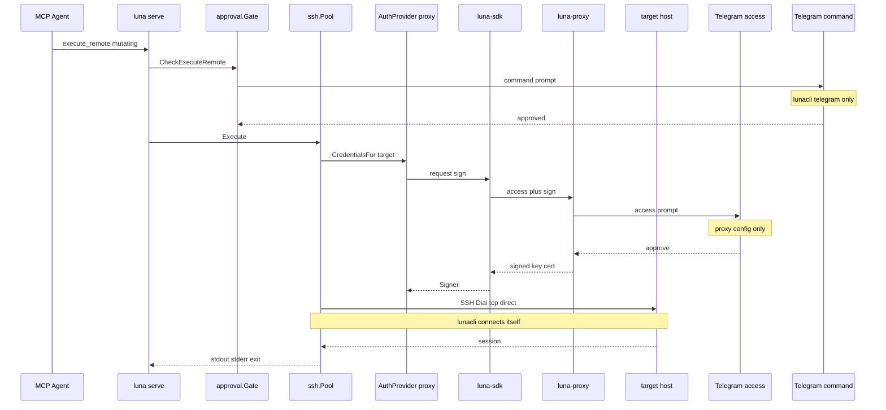

# Luna SDK proxy signing — Design Spec

**Date:** 2026-06-01  
**Status:** Approved design (revised — proxy signs keys; lunacli dials targets directly; proxy-only signers in `proxy` mode)  
**Scope:** Integrate `luna-sdk` from `github.com/ba0f3/luna-ztrust/luna-sdk` (local dev: `replace` → `../ba0f3/luna-ztrust/luna-sdk`) so lunacli uses **luna-proxy** by default for **SSH key signing and access approval**, while **lunacli still dials and connects to target hosts directly**.

## Summary

lunacli today dials targets **directly** over TCP/SSH (`golang.org/x/crypto/ssh`), authenticating with `SSH_AUTH_SOCK`, `IdentityFile`, or `id_*`, and gates **mutating commands** with out-of-band Telegram via `internal/approval`.

**luna-proxy does not carry SSH traffic.** It **signs keys** (SSH certificates or equivalent) after **per-target access approval** on the proxy’s own Telegram (configured on the proxy — **not** in lunacli). After access is granted, **lunacli** uses the signed material from **luna-sdk** as the **only** auth method for that target (in `proxy` mode) and **still runs** `gossh.Dial` to the target itself — same host keys / `known_hosts` behavior as today.

Command classification and command approval in lunacli are **unchanged**.

Non-recommended modes (`luna-agent`, direct `ssh-agent` / disk keys) remain **opt-in** with startup warnings.

## Goals

1. Default all remote SSH entrypoints (`luna serve`, `ssh-debug`, future `luna exec`) to obtain credentials via **luna-proxy signing** (`transport.mode: proxy`).
2. **Two-layer human approval:** access + signing (proxy) then command (lunacli Telegram).
3. **Keep direct SSH connectivity** from lunacli to managed hosts (no SSH relay through proxy).
4. **Do not** put proxy Telegram settings in lunacli config.
5. Preserve existing command approval semantics and tests.
6. Allow opt-in legacy auth with clear “not recommended” signaling.

## Non-goals

- SSH bastion / jump-host mode where proxy terminates or forwards sessions.
- Proxy Telegram in `luna.config.json` or `LUNA_PROXY_TELEGRAM_*` in lunacli.
- Auto-fallback from proxy signing to `ssh-agent` on errors.
- Rich `hosts.yml` in access prompts (v1: host, user, port, host-key fingerprint — shown by proxy).
- Merging access and command Telegram channels.

## Dependency

```go
require github.com/ba0f3/luna-ztrust/luna-sdk v0.x.x

replace github.com/ba0f3/luna-ztrust/luna-sdk => ../ba0f3/luna-ztrust/luna-sdk
```

## Architecture and trust boundaries

```text
┌─────────────────────────────────────────────────────────────┐
│  Untrusted: MCP agent                                        │
└───────────────────────────────┬─────────────────────────────┘
                                │ MCP stdio
                                v
┌─────────────────────────────────────────────────────────────┐
│  luna-cli                                                      │
│  • engine + approval.Gate (command Telegram)                 │
│  • ssh.Pool: TCP/SSH dial ───────────────────────────────┐   │
│  • AuthProvider (default: proxy signer via luna-sdk)        │   │
└───────────────────────────────┬───────────────────────────┼───┘
                                │ signing API only          │ SSH/tcp
                                v                           v
┌───────────────────────────────────┐            ┌─────────────────┐
│  luna-proxy                        │            │  target host     │
│  • access approval (proxy Telegram)│            │  (remote Linux)  │
│  • sign SSH key/cert for target    │            └─────────────────┘
└───────────────────────────────────┘
```

**Roles**

| Component | Does | Does not |
|-----------|------|----------|
| **luna-proxy** | Access approval; **sign** credentials bound to target (+ metadata) | Dial targets for lunacli; relay SSH streams |
| **lunacli** | Classify commands; command approval; **dial target**; verify `known_hosts`; run sessions/SFTP | Hold long-lived private keys for proxy mode (uses signed creds from SDK) |
| **luna-agent** (opt-in) | SDK path without adequate target context | Recommended default |
| **ssh-agent / disk keys** (opt-in) | Local auth, no proxy access gate | Human-in-the-loop access approval |

**Ordering invariant:** Valid **access + signed credential** for the target before SSH auth succeeds. **Access/sign grant does not skip mutating command approval.**



## Configuration (lunacli only)

```json
{
  "config_dir": "~/.config/luna/luna.d",
  "transport": {
    "mode": "proxy",
    "proxy": {
      "endpoint": "https://proxy.example:8443"
    }
  },
  "approval": { "ttl": "10m" },
  "telegram": {
    "bot_token_file": "~/.config/luna/telegram-bot-token",
    "approver_user_id": "52007861",
    "chat_id": "52007861"
  }
}
```

### `transport.mode`

| Value | SSH dial | Authentication |
|-------|----------|----------------|
| `proxy` (default) | **lunacli → target** (direct) | Signed key/cert from luna-proxy via SDK after access approval |
| `luna-agent` | lunacli → target (direct) | SDK agent path; **not recommended** (weak target binding) |
| `direct` | lunacli → target (direct) | `SSH_AUTH_SOCK` + `IdentityFile` + `id_*`; **not recommended** (no access approval) |

### Environment overrides

| Variable | Field |
|----------|--------|
| `LUNA_TRANSPORT_MODE` | `transport.mode` |
| `LUNA_PROXY_ENDPOINT` | `transport.proxy.endpoint` |

Command approval env vars unchanged.

### Validation

| Check | When |
|-------|------|
| `mode=proxy` → `endpoint` set | Remote entrypoints |
| Command `telegram` configured | `BootstrapServeApproval` |
| `direct` / `luna-agent` | Warning + audit `transport_non_recommended` |

Credential lifetime and per-target reuse are defined by **luna-proxy / SDK** (signed cert TTL, etc.). lunacli caches `gossh.Signer`(s) per normalized target only as long as the SDK indicates they remain valid.

## Access + signing flow (proxy mode)

**Trigger:** First SSH to normalized `user@host:port` in this process, or cached signer expired.

1. Resolve target (`parseTarget`, `~/.ssh/config` user fallback).
2. `AuthProvider.CredentialsFor(ctx, target)` → SDK → proxy.
3. Proxy prompts on **its** Telegram: `user`, `host`, `port`, expected host-key fingerprint (minimal).
4. Human approves → proxy **signs** credential scoped to that target (and metadata the proxy enforces).
5. SDK returns `[]ssh.Signer` (or cert + key) to lunacli.
6. `Pool.getClient` builds `gossh.ClientConfig` with those signers, **`HostKeyCallback` / `known_hosts` unchanged (local)**.
7. **`gossh.Dial("tcp", host:port, cfg)` from lunacli** — not via proxy.

On deny/expiry: no dial (`ACCESS_DENIED` / `ACCESS_EXPIRED`). Read-only commands still need valid signed access before dial.

## Command flow (lunacli, unchanged)

Mutating `execute_remote`:

1. `engine` classifies.
2. `approval.Gate` — `PERMISSION_REQUIRED`, `approval_id`, command Telegram.
3. After `GateExecute` → `Pool.Execute` → access/sign (above) → **direct** SSH session → run command.

## Code layout

| Location | Role |
|----------|------|
| `internal/config` | `transport` schema |
| `internal/ssh/auth.go` | `AuthProvider` interface + `NewAuthProvider(settings)` |
| `internal/ssh/auth_proxy.go` | SDK: access + signed signers for target |
| `internal/ssh/auth_direct.go` | Current `collectAuthSigners` behavior |
| `internal/ssh/auth_agent.go` | SDK luna-agent (opt-in) |
| `internal/ssh/pool.go` | **Keep** dial, known_hosts, session, SFTP; inject signers from `AuthProvider` |
| `internal/approval/*` | Unchanged |
| `cmd/serve.go` | `ssh.NewPool(settings)` |

### `AuthProvider` interface (replaces “transport executes remotely”)

```go
type Target struct {
    User, Host, Port string
    Raw              string
}

// AuthProvider supplies SSH signers for a target. It may block on proxy access approval.
type AuthProvider interface {
    SignersFor(ctx context.Context, t Target) ([]gossh.Signer, error)
}

func NewAuthProvider(cfg *config.Settings) (AuthProvider, error)
```

`Pool.getClient`:

1. `signers, err := p.auth.SignersFor(ctx, target)`
2. Build auth from signers (proxy mode: **do not** merge `SSH_AUTH_SOCK` / disk keys unless explicitly documented for migration)
3. `gossh.Dial("tcp", addr, sshCfg)` — existing known_hosts and algorithm logic

### SDK expectations

- Request signing for a concrete `user@host:port` (+ fingerprint hint).
- Block until access approved or return typed pending/denied errors.
- Return signers/certs usable with `golang.org/x/crypto/ssh`.
- **No** “execute command on remote via proxy” API required for v1.

### Why not `luna-agent` / `ssh-agent` as default

| Mode | Issue |
|------|--------|
| **luna-agent** | Signing/auth path lacks reliable **target** binding for access prompts and policy |
| **ssh-agent / direct** | No proxy **access** approval; keys usable without human gate for connect |

## Error surfaces

| Situation | Shape |
|-----------|--------|
| Access/sign pending | `ACCESS_REQUIRED:` + target |
| Access denied / expired | `ACCESS_DENIED:` / `ACCESS_EXPIRED:` |
| SSH dial/auth failure | Existing SSH error text (after sign granted) |
| Command pending | `PERMISSION_REQUIRED:` (unchanged) |

## Audit events (new)

`transport_mode`, `access_requested`, `access_approved`, `access_denied`, `access_expired`, `sign_issued` (if SDK hook), `transport_non_recommended`.

## Testing

### Unit

- `fakeAuthProvider` returns fixed signer; Pool still dials (mock `Dial` in tests or integration tag).
- Proxy mode does not call `sharedAgentSigners` when policy says proxy-only auth.
- Gate tests unchanged.

### Manual

1. Approve access on **proxy** Telegram → lunacli connects **directly** to target IP (tcpdump / target auth.log shows **lunacli** source IP, not proxy).
2. Mutating command → **lunacli** command Telegram → execute.
3. `mode=direct` → local agent keys, warning logged.

## Rollout phases

| Phase | Work |
|-------|------|
| 1 | `go.mod`, config, `AuthProvider` + proxy signer |
| 2 | Wire `Pool.getClient` to `SignersFor`; default `proxy` |
| 3 | `ssh-debug` shows mode, signer source, dial target |
| 4 | Docs + CI with `luna-sdk` |

## Approaches considered

| Approach | Verdict |
|----------|---------|
| **Signing provider + direct dial** | **Chosen** — matches proxy role; minimal change to Pool execution path |
| Proxy as SSH relay / transport | **Rejected** — wrong; proxy only signs |
| SDK replaces entire `internal/ssh` | Rejected — loses known_hosts and debuggability |

## Open items

1. Exact SDK API: sign cert vs raw key, TTL, cache invalidation.
2. Proxy mode: strictly exclusive signers vs allow fallback to disk keys (recommend **exclusive** for zero-trust).
3. Fingerprint in access prompt: lunacli passes `known_hosts` hash to SDK, or proxy discovers on first sign request.

## Related specs

- [2026-05-16-remote-human-approval-design.md](./2026-05-16-remote-human-approval-design.md)
- [2026-05-22-luna-mcp-inmemory-approval-design.md](./2026-05-22-luna-mcp-inmemory-approval-design.md)
- [2026-05-19-interceptor-redesign-design.md](./2026-05-19-interceptor-redesign-design.md)
