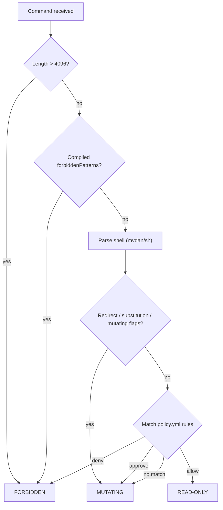

# Luna zero-trust interceptor

This guide explains the **zero-trust redesign** of the Luna interceptor: what it
is for, how it relates to the design spec and implementation plan, and how to
configure and run it today.

**Source documents**

| Document | Role |
| -------- | ---- |
| [Design spec](../superpowers/specs/2026-05-19-interceptor-redesign-design.md) | Target architecture, security model, CLI/MCP surface, fleet and audit design |
| [Implementation plan](../superpowers/plans/2026-05-19-zero-trust-redesign.md) | Phased build checklist (Phases 1–5 landed on `main`; fleet/audit CLI deferred) |

**Example configuration**

Copy or symlink from [`examples/luna.d/`](../examples/luna.d/README.md) into one of
the config search paths below.

---

## Core principle

**Never trust the AI agent.** Remote commands are classified before execution.
Read-only commands may run immediately when policy allows. Mutating commands
always require **out-of-band human approval** — there is no `allow_mutations`
self-approval path.

SSH authentication is unchanged: `~/.ssh/known_hosts`, `~/.ssh/config`,
`SSH_AUTH_SOCK`, and default keys. Luna does not store credentials in YAML.

---

## What shipped vs what is planned

### Implemented (Phases 1–5)

| Area | Package / command | Notes |
| ---- | ----------------- | ----- |
| Config resolution | `internal/config` | `LUNA_CONFIG_DIR`, `./luna.d`, `~/.config/luna`, `/etc/luna` |
| Policy loader | `internal/policy` | **`policy.yml` required** for `luna serve` |
| Hosts loader | `internal/config` | **`hosts.yml` optional** (inventory for future fleet tools) |
| Hybrid engine | `internal/engine` | Layer 1 compiled forbidden patterns + Layer 2 YAML rules |
| Approvals | `internal/approval` | In-memory store; Telegram-only OOB; poll loop inside `serve` |
| Audit logger | `internal/audit` | JSON-lines to stderr + file (**library only** — not yet wired into `execute_remote`) |
| CLI | `cmd` | `serve` only (explicit subcommand) |
| MCP | `execute_remote` | Uses engine + gate; `approval_id` retry |

### Planned (design spec; not yet in tree)

- `luna plan`, `luna policy check|validate`, `luna hosts list|describe|ping`
- `luna audit` queries; audit events on every classification/execution
- Fleet: `ssh_run_on_tag`, async task tools (`internal/fleet`)
- MCP: `ssh_plan`, `describe_host`, `ssh_ping`, fleet/async tools

Treat the [design spec](../superpowers/specs/2026-05-19-interceptor-redesign-design.md)
as the north star; the [implementation plan](../superpowers/plans/2026-05-19-zero-trust-redesign.md)
tracks incremental delivery.

---

## Binary and modes

Build from `interceptor/`:

```bash
make build   # → ../bin/luna-interceptor
```

The binary registers as `luna` in Cobra help. MCP clients must invoke an explicit
subcommand, e.g. `./bin/luna serve` (stdio MCP). Plain `luna` prints usage.

| Command | Purpose |
| ------- | ------- |
| `luna` | Print usage (no implicit subcommand) |
| `luna serve` | Stdio MCP server: policy, approvals in memory, Telegram poll |

---

## Configuration layout

Luna loads **`policy.yml`** (required) and optionally **`hosts.yml`** from the
config directory resolved by:

1. `LUNA_CONFIG_DIR` (environment)
2. `config_dir` in `luna.config.json` / `~/.config/luna/config.json`
3. `./luna.d/` if the directory exists
4. `~/.config/luna/` if it exists
5. `/etc/luna/`

**Interceptor settings** (approval store, providers, CLI approvers, Telegram) use
JSON config files first, then env — see [oob-approval.md](oob-approval.md):

1. `~/.config/luna/config.json`
2. `./luna.config.json`
3. `LUNA_*` environment variables

### Quick start

```bash
mkdir -p luna.d
cp examples/luna.d/policy.yml examples/luna.d/hosts.yml luna.d/
# Edit hosts to match your SSH targets
cd interceptor && make build
./bin/luna serve
```

### `policy.yml`

Defines **deny-by-default** command policy on top of the immutable compiled
safety net.

| Field | Meaning |
| ----- | ------- |
| `version` | Schema version (use `1`) |
| `deny_patterns` | Extra regexes → **forbidden** (cannot be approved) |
| `rules[]` | Evaluated **top to bottom**; first matching rule wins |

Each rule:

| Field | Meaning |
| ----- | ------- |
| `action` | `allow` (read-only, auto-run), `approve` (mutating, needs OOB approval), `deny` (blocked by policy) |
| `hosts` | Host identifiers or `*` |
| `tags` | Host tags from `hosts.yml`, or `*`; omit tag constraints when empty |
| `commands[]` | `binary` + optional `args_prefix` (prefix match on argv after binary) |

**Default when no rule matches:** treated as **mutating** → `PERMISSION_REQUIRED`.

See [example policy](../examples/luna.d/policy.yml) and the full rule catalog in the
[design spec §2](../superpowers/specs/2026-05-19-interceptor-redesign-design.md).

### `hosts.yml`

Optional inventory: alias, SSH target, tags, description. Used for documentation
and future tag-based fleet execution. Ad-hoc `host` strings in
`execute_remote` still work when `hosts.yml` is absent.

See [example hosts](../examples/luna.d/hosts.yml).

---

## Security engine (two layers)



**Layer 1 — compiled (immutable):** catastrophic ops (`rm -rf /`, disk tools,
`sudo`, reverse shells, etc.). Cannot be overridden by YAML.

**Layer 2 — YAML:** operator-defined allow / approve / deny lists.

The legacy `internal/security/allowlist.go` prefix lists are superseded by
policy for allow/approve decisions; hardcoded patterns remain in
`internal/engine/hardcoded.go`.

---

## Approvals (always out-of-band)

Full operator configuration (env vars, CLI, Telegram, OpenCode example):
**[oob-approval.md](oob-approval.md)** · [env.example](../examples/luna.d/env.example)

Summary:

- No `allow_mutations` or `LUNA_APPROVAL_MODE` — mutating commands always need
  human approval via `approval_id` after OOB approve.
- `LUNA_APPROVAL_STORE` (default `approvals.db`), `LUNA_APPROVAL_TTL` (default `5m`),
  `LUNA_APPROVAL_PROVIDER` (`fake` / `telegram`), `LUNA_CLI_APPROVER_USERS` for CLI approve.

---

## MCP tool: `execute_remote`

| Response prefix | Meaning | Agent action |
| --------------- | ------- | ------------ |
| (normal output) | Executed | Continue |
| `PERMISSION_REQUIRED:` | Mutating, needs approval | Stop; human approves; retry with `approval_id` |
| `BLOCKED:` | Forbidden | Do not retry |

Parameters: `host`, `command`, `timeout_sec`, `approval_id` (no `allow_mutations`).

---

## Audit logging (partial)

The `internal/audit` package writes JSON lines to **stderr** and an optional
file. Wiring into `serve` / `execute_remote` and `luna audit` CLI are **not**
implemented yet. Planned event types and `LUNA_AUDIT_FILE` are described in
[design spec §6](../superpowers/specs/2026-05-19-interceptor-redesign-design.md).

---

## Implementation plan map

The [implementation plan](../superpowers/plans/2026-05-19-zero-trust-redesign.md)
is organized in phases:

| Phase | Focus | Status |
| ----- | ----- | ------ |
| 1 | `config` + `policy` loaders | Done |
| 2 | `engine` hybrid classification | Done |
| 3 | OOB-only `approval` gate | Done |
| 4 | `audit` logger package | Package done; integration pending |
| 5 | Cobra CLI (`serve`, `exec`, `approvals`) | Done |
| — | Fleet, extra CLI, MCP fleet tools | Not started |

Agents implementing follow-ups should use the plan’s checkbox tasks and
**subagent-driven-development** or **executing-plans** skills.

---

## Migration from pre-redesign behavior

| Before | After |
| ------ | ----- |
| `LUNA_APPROVAL_MODE=local` + `allow_mutations=true` | Removed; use `approval_id` after CLI/Telegram approve |
| `LUNA_APPROVAL_MODE=remote` | Default behavior; set `LUNA_APPROVAL_STORE` if not using default path |
| Implicit allowlist in Go (`readOnlyPrefixes`) | Explicit `policy.yml` rules |
| MCP starts without config | **`policy.yml` required** or `serve` exits |

Update agent prompts (`instructions/`, `AGENTS.md`) to describe `approval_id`
only — not `allow_mutations`.

---

## Related docs

- [OOB approval configuration](oob-approval.md) — environment variables, CLI, Telegram
- [Remote approval (Telegram summary)](remote-approval.md) — short pointer to OOB doc
- [goclaw integration](goclaw-integration.md) — untrusted agent deployments
- [AGENTS.md](../AGENTS.md) — project rules for Luna agents
